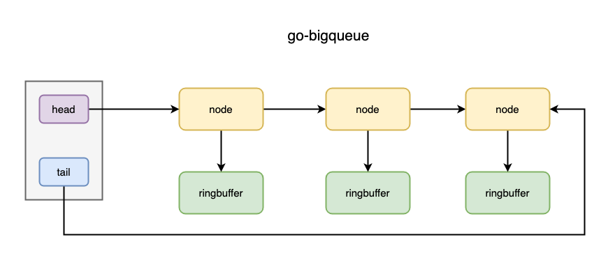

# go-bigqueue

golang bigqueue is the same as redis quicklist. bigqueue is made up of ringbuffer and linkedlist.

feature:

- thread safe, simple api, safe memory.
- compared with `chan []byte`, bigqueue reduce gc latency.
- compared with `a big single ringbuffer []byte`, bigqueue is easier to expand and shrink.



> the some code of ringbuffer copy from bigcache/queue.

## usage

```go
func NewQueue(capacity int, maxCapacity int) *BigQueue
func NewQueueChains(bucketBytes int, maxBuckets int) *BigQueueChains
func Reset()
func Push(data []byte)
func Pop() []byte
func Len() int
func BucketLength() int
func Full() bool
```

## example

### simple

```go
package main

import (
	"log"
	"math/rand"
	"strings"
	"time"

	"github.com/rfyiamcool/go-bigqueue"
)

func init() {
	rand.Seed(time.Now().Unix())
}

func randString(n int) string {
	const letterBytes = "0123456789abcdefghijklmnopqrstuvwxyzABCDEFGHIJKLMNOPQRSTUVWXYZ"
	b := make([]byte, n)
	for i := range b {
		b[i] = letterBytes[rand.Intn(len(letterBytes))]
	}
	return string(b)
}

func main() {
	var (
		count       = 100000           // 10w
		bucketBytes = 10 * 1024 * 1024 // 100mb
		maxBuckets  = 10               // 100mb * 10
	)

	queue := bigqueue.NewQueueChains(bucketBytes, maxBuckets)

	for i := 0; i < count; i++ {
		length := rand.Intn(1024)
		bs := "{{" + randString(length) + "}}"
		queue.Push([]byte(bs))
	}

	incr := 0
	for i := 0; i < count; i++ {
		val, err := queue.Pop()
		if err != nil {
			break
		}

		str := string(val)
		if strings.HasSuffix(str, "}}") && strings.HasPrefix(str, "{{") {
			incr++
			continue
		}

		panic("error")
	}

	if incr != count {
		log.Panicf("counter error")
	}

	log.Println("ok")
}
```

### concurrent

```go
package main

import (
	"log"
	"math/rand"
	"strings"
	"sync"
	"time"

	"github.com/rfyiamcool/go-bigqueue"
)

func randString(n int) string {
	const letterBytes = "0123456789abcdefghijklmnopqrstuvwxyzABCDEFGHIJKLMNOPQRSTUVWXYZ"
	b := make([]byte, n)
	for i := range b {
		b[i] = letterBytes[rand.Intn(len(letterBytes))]
	}
	return string(b)
}

func main() {
	var (
		count       = 100000           // 10w
		bucketBytes = 10 * 1024 * 1024 // 100mb
		maxBuckets  = 10               // 100mb * 10
		wg          = sync.WaitGroup{}
	)

	queue := bigqueue.NewQueueChains(bucketBytes, maxBuckets)

	incr := 0
	wg.Add(1)
	go func() {
		defer wg.Done()

		for i := 0; i < count; i++ {
			time.Sleep(time.Duration(rand.Intn(5)) * time.Microsecond) // < 10us

			val, err := queue.Pop()
			for err == bigqueue.ErrEmptyQueue {
				time.Sleep(1 * time.Microsecond)
				val, err = queue.Pop()
			}

			str := string(val)
			if strings.HasSuffix(str, "}}") && strings.HasPrefix(str, "{{") {
				incr++
				continue
			}

			return
		}
	}()

	wg.Add(1)
	go func() {
		defer wg.Done()

		for i := 0; i < count; i++ {
			time.Sleep(time.Duration(rand.Intn(5)) * time.Microsecond) // < 10us

			length := rand.Intn(1024)
			bs := "{{" + randString(length) + "}}"
			queue.Push([]byte(bs))
		}
	}()
	wg.Wait()

	if incr != count {
		log.Panicf("counter error")
	}

	log.Println("ok")
}

```